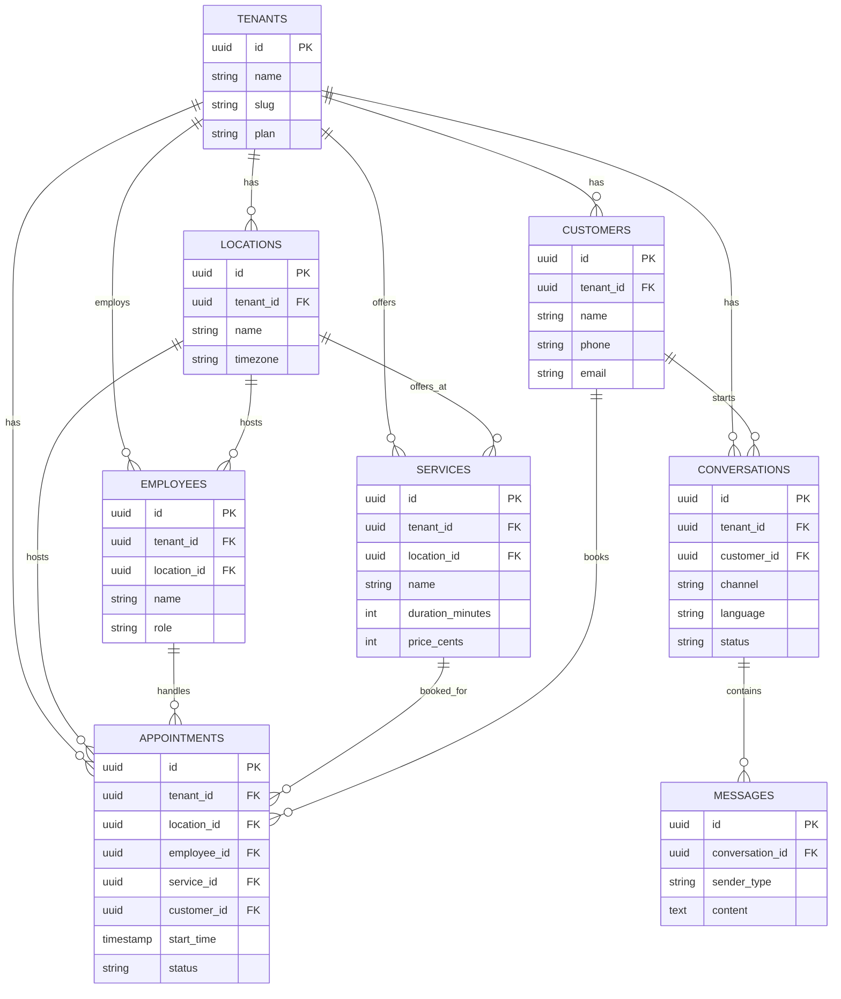

# Datenmodell (Version 1)

Dieses Dokument beschreibt das Kern-Datenmodell für Version 1 des KI-Terminassistenten. Der Stack ist Node.js/TypeScript mit PostgreSQL.

## Multi-Tenancy

Jeder Betrieb ist ein eigener Tenant. Jede Tabelle, die betriebsspezifische Daten enthält, trägt eine `tenant_id`. Damit ist die Isolation zwischen Betrieben von Anfang an im Schema verankert und muss nicht nachträglich migriert werden.

Felder wie `location_id` und `employee_id` sind bereits in Version 1 vorgesehen, auch wenn ein Betrieb anfangs nur einen Standort und keine zusätzlichen Mitarbeiter hat. Das vermeidet spätere Breaking-Change-Migrationen für Version 2 (mehrere Mitarbeiter/Standorte).

## Entitäten

### tenants
Der Betrieb (Kunde des SaaS).

| Feld | Typ | Beschreibung |
|---|---|---|
| id | uuid PK | |
| name | string | Firmenname |
| slug | string | eindeutiger Bezeichner, z. B. für URLs |
| plan | string | Abo-Stufe (Version/Modul-Freischaltung) |
| subscription_status | string | aktiv, gekündigt, testphase |
| created_at | timestamp | |

### locations
Standort eines Betriebs.

| Feld | Typ | Beschreibung |
|---|---|---|
| id | uuid PK | |
| tenant_id | uuid FK → tenants | |
| name | string | z. B. "Köln" |
| address | string | |
| phone | string | |
| timezone | string | |
| opening_hours | jsonb | Öffnungszeiten je Wochentag |

### employees
Mitarbeiter eines Betriebs.

| Feld | Typ | Beschreibung |
|---|---|---|
| id | uuid PK | |
| tenant_id | uuid FK → tenants | |
| location_id | uuid FK → locations | Stammstandort |
| name | string | |
| email | string | |
| role | string | z. B. Techniker, Admin |
| working_hours | jsonb | reguläre Arbeitszeiten |
| vacation_days | jsonb | Urlaub/Abwesenheit |

### services
Dienstleistung, die ein Betrieb anbietet.

| Feld | Typ | Beschreibung |
|---|---|---|
| id | uuid PK | |
| tenant_id | uuid FK → tenants | |
| location_id | uuid FK → locations, nullable | leer = an allen Standorten verfügbar |
| name | string | |
| category | string | |
| duration_minutes | int | |
| price_cents | int, nullable | optional |
| area_size | string, nullable | Flächengröße |
| is_emergency | boolean | Notdienst |

### customers
Kunde eines Betriebs.

| Feld | Typ | Beschreibung |
|---|---|---|
| id | uuid PK | |
| tenant_id | uuid FK → tenants | |
| name | string | |
| phone | string | |
| email | string | |
| address | string | |
| notes | text | |
| created_at | timestamp | |

### appointments
Gebuchter Termin.

| Feld | Typ | Beschreibung |
|---|---|---|
| id | uuid PK | |
| tenant_id | uuid FK → tenants | |
| location_id | uuid FK → locations | |
| employee_id | uuid FK → employees, nullable | |
| service_id | uuid FK → services | |
| customer_id | uuid FK → customers | |
| start_time | timestamp | |
| end_time | timestamp | |
| status | string | angefragt, bestätigt, storniert, abgeschlossen |
| created_via | string | chat, telefon, manuell |

### conversations
Chat-/Kommunikationsverlauf mit einem (potenziellen) Kunden.

| Feld | Typ | Beschreibung |
|---|---|---|
| id | uuid PK | |
| tenant_id | uuid FK → tenants | |
| customer_id | uuid FK → customers, nullable | leer, solange Kunde nicht identifiziert |
| channel | string | web_chat (V1), whatsapp/sms/email (später) |
| language | string | erkannte Sprache |
| status | string | aktiv, eskaliert, geschlossen |
| summary | text | KI-generierte Zusammenfassung für den Betrieb |
| escalated_to_employee_id | uuid FK → employees, nullable | |

### messages
Einzelne Nachricht innerhalb einer Conversation.

| Feld | Typ | Beschreibung |
|---|---|---|
| id | uuid PK | |
| conversation_id | uuid FK → conversations | |
| sender_type | string | customer, ai, employee |
| content | text | |
| created_at | timestamp | |

## Entity-Relationship-Diagramm

## Ausblick auf spätere Versionen

- **Version 2**: `employees`/`locations` bekommen mehr Gewicht (mehrere Mitarbeiter, mehrere Standorte); `conversations.channel` erweitert sich um whatsapp/sms.
- **Version 3**: neue Tabellen `quotes` (Angebote) und `invoices` (Rechnungen), referenzieren `tenant_id`, `customer_id`, optional `appointment_id`.
- **Version 4**: `tenants` bekommt Felder für unterstützte Sprachen; keine strukturellen Änderungen am Kernmodell nötig, da Mehrsprachigkeit auf Anwendungsebene (Übersetzung von `services.name` etc.) gelöst wird.
